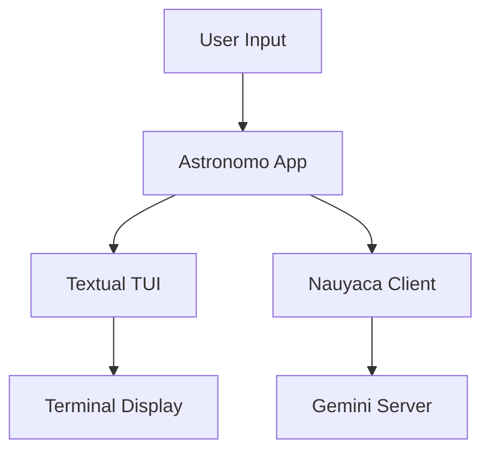
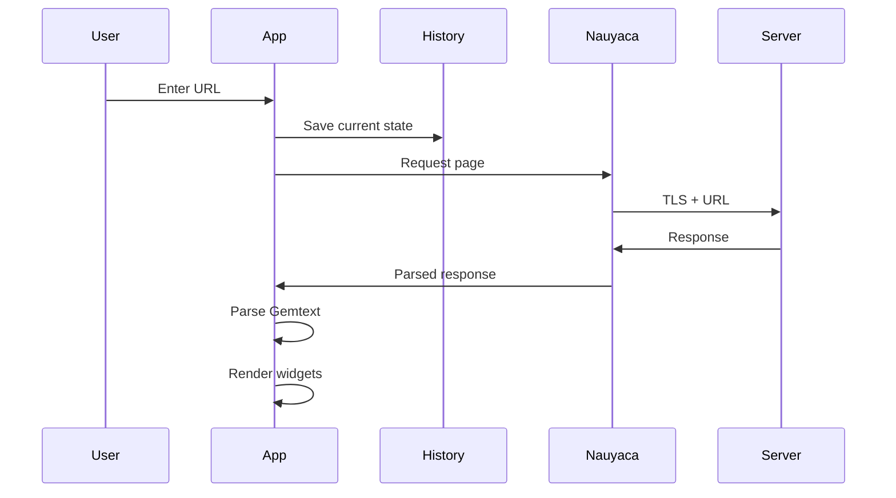
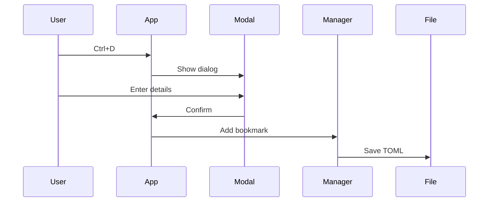

# Architecture

This page explains how Astronomo is built and how its components work together.

## Overview

Astronomo is a terminal-based Gemini browser built with:

- **Python 3.10+** - Programming language
- **Textual** - TUI (Terminal User Interface) framework
- **Nauyaca** - Gemini protocol library
- **TOML** - Configuration and data storage format



## Core Components

### Main Application (`astronomo_app.py`)

The central `Astronomo` class extends Textual's `App`:

- Handles user input and keyboard bindings
- Manages navigation and history
- Coordinates between UI and network
- Loads and applies configuration

### Parser (`parser.py`)

Converts Gemtext content into structured data:

```python
from astronomo.parser import parse_gemtext, LineType

lines = parse_gemtext(content)
for line in lines:
    if line.line_type == LineType.HEADING:
        # Handle heading
    elif line.line_type == LineType.LINK:
        # Handle link
```

Supported line types:

- `TEXT` - Plain paragraph
- `HEADING` - Levels 1-3
- `LINK` - With URL and optional text
- `LIST_ITEM` - Unordered list item
- `BLOCKQUOTE` - Quoted text
- `PREFORMATTED` - Code or ASCII art

### History Manager (`history.py`)

Maintains browsing session history:

```python
history = HistoryManager(max_size=100)

# Navigate
history.push(entry)
previous = history.go_back()
next_entry = history.go_forward()
```

Features:

- Fixed-size deque for automatic LRU eviction
- Stores scroll position and selected link
- In-memory only (not persisted)

### Bookmark Manager (`bookmarks.py`)

Handles bookmark persistence:

```python
manager = BookmarkManager()
bookmark = manager.add_bookmark(url, title, folder_id)
manager.save()  # Persists to TOML
```

Data model:

- `Bookmark` - URL, title, folder reference, timestamps
- `Folder` - Name and timestamps
- TOML file at `~/.config/astronomo/bookmarks.toml`

### Config Manager (`config.py`)

Loads and validates configuration:

```python
config = ConfigManager()
theme = config.theme
timeout = config.timeout
```

Uses nested dataclasses:

- `AppearanceConfig` - Theme settings
- `BrowsingConfig` - Timeout, redirects, home page
- `Config` - Top-level container

### Identity Manager (`identities.py`)

Manages client certificates:

```python
manager = IdentityManager()
identity = manager.create_identity("My ID", "user@example.com")
manager.set_identity_for_host("example.com", identity.id)
```

Storage:

- Metadata in `identities.toml`
- Certificate files (`.crt`, `.key`) per identity
- Host-to-identity mappings

## Widget Architecture

### GemtextViewer

The main content display widget containing specialized sub-widgets:

```
GemtextViewer
├── GemtextHeadingWidget (H1, H2, H3)
├── GemtextLinkWidget (interactive links)
├── GemtextTextWidget (paragraphs)
├── GemtextListItemWidget (bullet points)
├── GemtextBlockquoteWidget (quotes)
└── GemtextPreformattedWidget (code blocks)
```

All widgets extend `GemtextLineWidget` base class.

### Sidebar and Modals

- `BookmarksSidebar` - Toggleable bookmark panel
- `AddBookmarkModal` - Create bookmark dialog
- `EditItemModal` - Edit bookmark/folder
- `InputModal` - Handle status 10/11 prompts
- `IdentitySelectModal` - Choose client certificate

## Data Flow

### Page Navigation



### Bookmark Creation



## File Structure

```
src/astronomo/
├── __init__.py          # Entry point
├── astronomo_app.py     # Main App class
├── parser.py            # Gemtext parser
├── history.py           # History management
├── bookmarks.py         # Bookmark management
├── config.py            # Configuration
├── identities.py        # Certificate management
├── response_handler.py  # Response processing
├── syntax.py            # Syntax highlighting
├── screens/             # Full-screen views
│   └── settings.py
└── widgets/             # UI components
    ├── gemtext_viewer.py
    ├── bookmarks_sidebar.py
    ├── navigation.py
    └── ...modals...
```

## Design Decisions

### Why Textual?

- Native terminal rendering
- Rich widget system
- CSS-like styling
- Async-first design
- Active development

### Why TOML?

- Human-readable
- Built-in Python support (3.11+)
- Simple structure
- Comments supported

### Why In-Memory History?

- Privacy: No disk trace of browsing
- Simplicity: No persistence complexity
- Performance: No I/O overhead
- Session-scoped by design

### Why XDG Directories?

- Standard Linux convention
- User expectation
- Easy backup/migration
- Separation from application code
